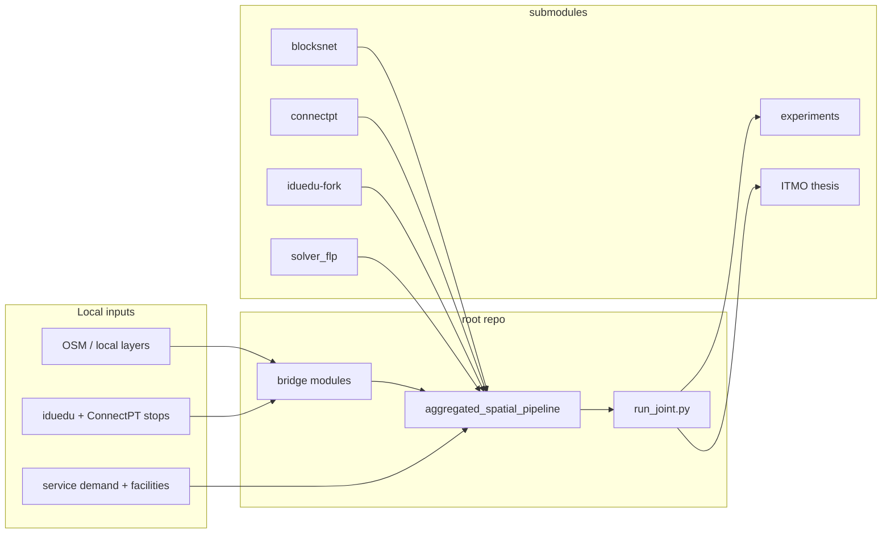
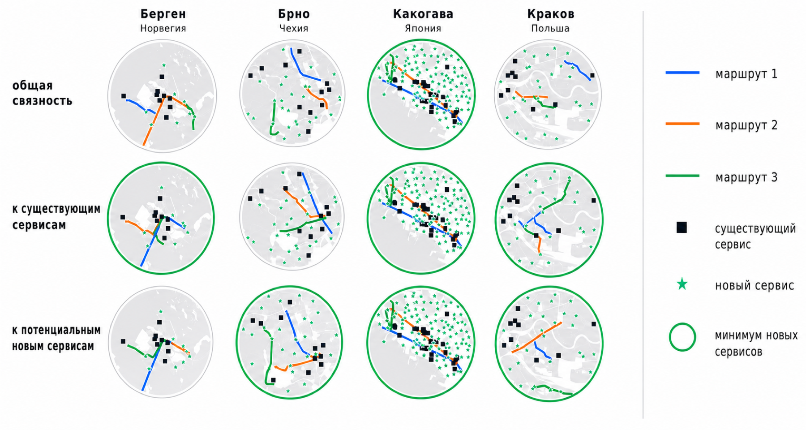

# super-duper-disser

[](https://github.com/aimclub/OSA)

Dissertation orchestration repo. The root stays thin: it wires submodules, bridge code, the aggregated spatial pipeline, and scripts that prepare thesis-ready outputs.

## System Map



## Main Result



## Run

Entrypoint: `aggregated_spatial_pipeline/pipeline/run_joint.py`

Human:

```bash
PYTHONPATH=$PWD .venv/bin/python -m aggregated_spatial_pipeline.pipeline.run_joint --place "Saint Petersburg, Russia" --buffer-m 5000 --street-grid-step 500
```

Agent: update submodules first, run a small city, then inspect manifests, parquet counts, and preview PNGs directly.

## Publication

Thesis source and publication bundle live in `itmo-phd-thesis-template-en/`; main PDF is `itmo-phd-thesis-template-en/thesis-itmo.pdf`.

## Next Steps / Heuristics

Keep this repo as orchestration only. Domain experiments, models, and paper-specific assets should stay in submodules; root code should only bridge them into the dissertation pipeline.

