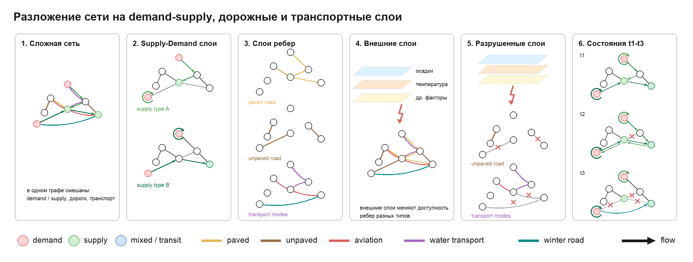
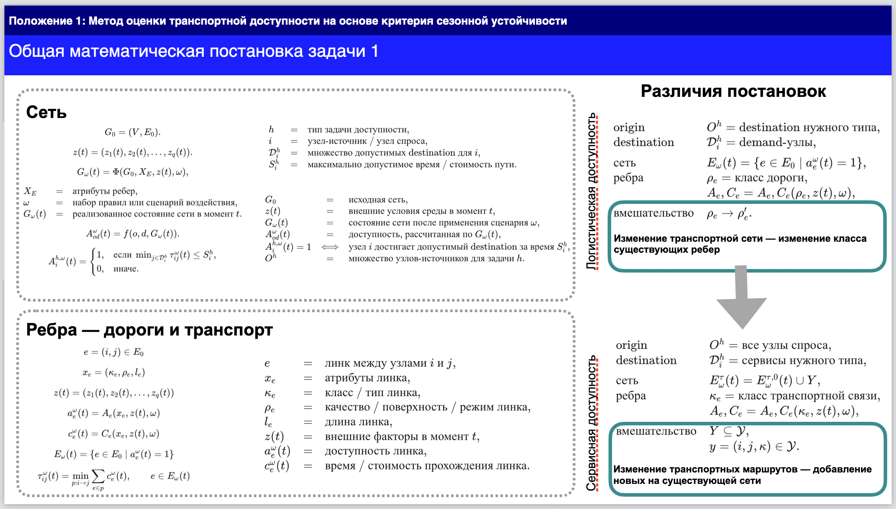
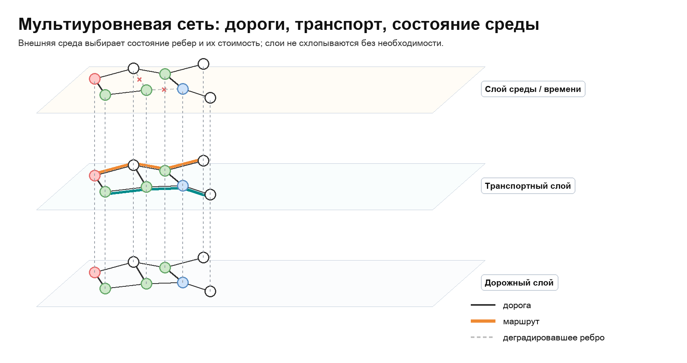
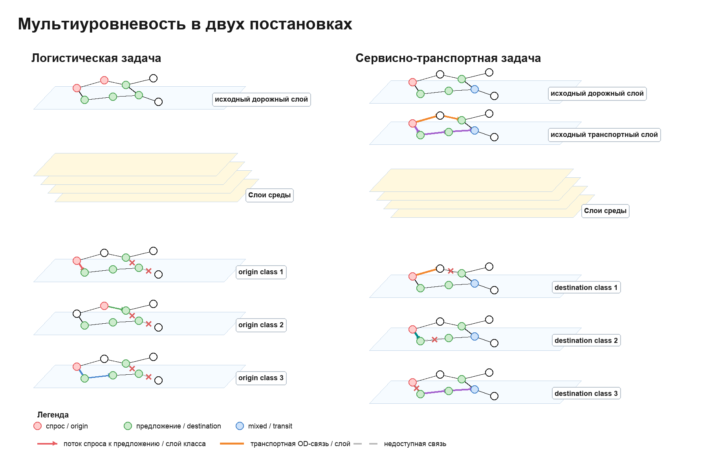

# Часть 1: доступность в сети, которая меняется из-за внешней среды

## 1. Доступность

Доступность рассматривается как достижимость допустимого destination из заданного origin при ограничении на время или стоимость пути.

В зависимости от постановки origin и destination задаются через demand/supply отношения:
- в сервисной задаче origin -- это узел спроса, destination -- сервис или supply-узел нужного типа;
- в логистической задаче origin -- это точка производства / supply, destination -- допустимый узел спроса или потребления.

Для origin `i` доступность равна `1`, если хотя бы один допустимый destination достижим в пределах заданного ограничения `S_i`:

$$
A_i(t)=
\begin{cases}
1, & \text{если } \min_{j\in D_i} T_{ij}(t) \le S_i,\\
0, & \text{иначе}.
\end{cases}
$$

$$
\begin{array}{lcl}
A_i(t) & = & \text{индикатор доступности origin } i,\\
D_i & = & \text{множество допустимых destination для } i,\\
S_i & = & \text{допустимое время или стоимость пути},\\
T_{ij}(t) & = & \text{время / стоимость пути от } i \text{ к } j.
\end{array}
$$

Значение `T_{ij}(t)` вычисляется по текущей реализации сети. Оно зависит от доступных ребер и их текущей стоимости:

$$
T_{ij}(t)=
\min_{\text{путь }p:i\to j}
\sum_{e\in p} c_e(t),
\qquad
e\in E(t).
$$

Здесь `E(t)` -- множество ребер, которые доступны в момент `t`:

$$
E(t)=
\{e\in E_0 \mid \text{open}_e(t)=1\}.
$$

Доступность и стоимость ребра зависят от его атрибутов и внешней среды:

$$
\text{open}_e(t)=\text{open}(x_e,z(t)),
\qquad
c_e(t)=\text{cost}(x_e,z(t)).
$$

$$
\begin{array}{lcl}
\text{open}_e(t) & = & \text{индикатор доступности ребра},\\
c_e(t) & = & \text{время / стоимость прохождения ребра},\\
x_e & = & \text{атрибуты ребра},\\
z(t) & = & \text{внешняя среда в момент } t.
\end{array}
$$

Основная схема:

---

## 2. Методологический обзор изменяемой доступности

Ниже обзор дан по двум линиям литературы, которые собраны в твоих статьях: арктические environment-framed networks и экваториальные climate-stressor supply chains. Внутри текста указаны не ссылки на твои статьи, а исходные работы, на которые они сами опираются.

### 2.1. Environment-framed networks

В этой линии литературы транспортная доступность рассматривается как часть более общей проблемы устойчивости settlement systems в условиях климата, который меняет саму структуру сети. Ключевой тезис здесь такой: в северных территориях доступность услуг не может считаться по фиксированному графу, потому что связи между поселениями сезонно появляются, исчезают и меняют свою применимость в зависимости от состояния среды (Dong et al. 2025; Waite et al. 2023; Povoroznyuk et al. 2022; Stephenson et al. 2011).

В related works и problem statement этой линии акцент сделан на том, что существующие resilience- и accessibility-подходы обычно недостаточно учитывают temporal and climatic factors. Для арктических территорий это принципиально, потому что многие дороги зимой работают, а в переходные сезоны становятся труднопроходимыми или исчезают из практической сети совсем. Поэтому традиционные индикаторы транспортной доступности, рассчитанные для статической сети, не отражают реальную service accessibility (Yin et al. 2023; Wang et al. 2023; Coates and Broderstad 2019; Lowe and Sharp 2021).

Дальше в этой литературе проводится различие между network connectivity и service accessibility. Сначала определяется, какие транспортные связи вообще допустимы в конкретный момент времени, а уже потом по этой допустимой сети считается достижимость service provider. Такой ход хорошо стыкуется с critical facility accessibility approaches, где нарушение дорог сначала меняет саму feasible network, а уже затем меняется доступность критических объектов (Gangwal et al. 2023).

Отдельно подчеркивается отличие такой рамки от classical multilayer transport networks. В большинстве multilayer transport studies слои понимаются как разные транспортные подсистемы: road, rail, aviation, water transport и так далее. Здесь же важнее другое: один climate-constrained backbone обслуживает разные service flows, и поэтому сама multilayer логика задается не только инфраструктурой, но и распределением demand to services (Li et al. 2025; Mei et al. 2025; Ye et al. 2025; Mishina et al. 2024).

В описании Arctic unique challenges выделяются четыре особенности, которые важны для методологии:
- сеть здесь не статическая, а dynamic, seasonal and context-dependent;
- multimodality носит не дополнительный, а обязательный характер;
- данные по реальным связям часто локальны, неформальны и плохо представлены в стандартных open datasets;
- spatial organization подчинена не только экономической оптимизации, но и логике доступа к ресурсам и жизненно важным сервисам.

В разделе про структуру сети объект моделирования описывается достаточно прямо. Nodes are towns and villages. Each settlement has population, services and transport facilities. Graph may contain several edges between the same pair of nodes because one settlement pair may be connected by more than one transport option. Edge attributes include transport mode and travel time. Для арктического случая важна и seasonal specificity: warm-period roads, cold-period roads, water transport, aviation and other mode-specific links (Haklay and Weber 2008; Dankin et al. 2022).

В разделе on transport modes and environmental constraints также подчеркивается, что transport modes are not just labels. У каждого режима есть собственные operating constraints. Winter roads зависят от температуры и периода устойчивого холода. Water transport зависит от навигационного сезона, ледовой обстановки и штормов. Aviation зависит от ветра, видимости, обледенения и состояния runway infrastructure. Следовательно, внешняя среда не просто "ухудшает сеть в целом", а по-разному воздействует на разные edge classes (Povoroznyuk et al. 2023; Barrette et al. 2022; Kong and Doré 2024; Touloumidis et al. 2025; Gu et al. 2025; Burbidge et al. 2024; Rahman et al. 2025).

Для methodological meaning части 1 из этой статьи напрямую берутся следующие положения:
- доступность должна считаться по realized network state, а не по базовому графу;
- ребра могут disappear / reappear seasonally;
- nodes при этом обычно не "разрушаются", а меняется feasibility of edges;
- service accessibility надо оценивать после фильтрации feasible transport links;
- multilayer interpretation здесь задается через service flows over a shared climate-constrained backbone.

### 2.2. Climate stressors and road-network accessibility

Во второй линии литературы контекст меняется с арктических service systems на equatorial urban agriculture supply chains, но сама логика остается близкой: внешняя среда меняет состояние транспортных связей, а через это меняется достижимость нужных destination. Здесь вместо seasonal multimodal constraints основной акцент делается на road quality, climate stressors и supply-chain vulnerability.

В этой литературе проблема ставится так: food systems in equatorial cities depend on transportation networks that operate under near-constant environmental stress. Когда эти сети нарушаются, сбой распространяется не только на отдельную дорогу, но и на supply chains, market access, spoilage, price stability and food availability. Поэтому транспортная сеть рассматривается не как нейтральный фон, а как critical infrastructure for urban food systems (Reardon and Zilberman 2018; Colon et al. 2019; Ofori et al. 2022; Karg et al. 2022).

В subsection `2.2 Supply Chain Impact Factors` выделяются три основные группы факторов:
- market accessibility;
- road infrastructure quality and network criticality;
- climate stressors.

Market accessibility трактуется широко: это не только физическая достижимость рынков по дорогам, но и издержки, информационные ограничения, расположение рынков, routing efficiency и способность системы реагировать на disruption. При этом подчеркивается, что informal markets особенно уязвимы, потому что зависят от плохо обслуживаемых дорог и часто не имеют cold storage или другой буферной инфраструктуры (Ofori et al. 2022; Karg et al. 2022).

Road infrastructure quality в статье занимает отдельное место. Прямо говорится, что critical road links such as bridges or narrow streets can have a disproportionate impact on network performance. Для equatorial regions важны unpaved roads, flooded urban roads, weak drainage and chronic underinvestment. Отсюда следует, что road segments должны различаться по quality and vulnerability, а одинаковый климатический фактор не должен одинаково интерпретироваться для всех links (Colon et al. 2019; Pregnolato et al. 2017; L’Her et al. 2023).

В блоке `Climate Stressors` перечисляются именно те внешние факторы, которые должны переводиться в сетевые параметры: flooding, high-intensity rainfall, heat, land-use change, impermeability и related vulnerabilities. Особенно важно, что repeatedly подчеркивается compounded effect: urban heat islands, flood risk and land-use dynamics together increase instability of transport networks. То есть methodological frame здесь допускает more than one environmental layer (Pregnolato et al. 2017; Arifai and Arsyad 2025; Wei et al. 2022).

В блоке `Transport Network Stability and Resilience` собираются основные families of methods, которые используются в чужой литературе:
- network criticality and input-output coupling;
- agent-based propagation of disruption effects;
- complex network theory with flood scenarios;
- pluvial flood impact modeling;
- techno-economic route disruption analysis.

Дальше статья прямо перечисляет common tools and metrics:
- network criticality analysis;
- input-output economic linkage modeling;
- agent-based simulation;
- complex network metrics such as efficiency, betweenness centrality, robustness;
- flood inundation scenarios;
- route disruption cost analysis.

Для части 1 важен и блок `Research Gaps`. Там почти в лоб сформулированы ограничения существующей литературы:
- мало работ именно про urban agriculture supply chains;
- combined stressors usually are not integrated in one framework;
- informal market dynamics are poorly represented;
- standardized methodologies are missing;
- context-specific vulnerability makes direct transfer difficult.

То есть эта линия работ дает не только предметный кейс, но и прямой обзор того, какие методы уже используются и чего им не хватает. Для твоего пункта 2 это полезно именно как source text: здесь уже перечислены hydrological, accessibility, network-theory and supply-chain approaches без необходимости дополнительно собирать их заново (Colon et al. 2019; Pregnolato et al. 2017; Wei et al. 2022; L’Her et al. 2023).

### 2.3. Что прямо следует из этих двух источников

Если держаться только этих двух статей, без дальнейшего синтеза, то для части 1 можно зафиксировать такой методический минимум:

- Арктическая линия литературы задает environment-framed reading of accessibility:
  сеть seasonal, multimodal, edge-dependent and service-flow-dependent (Dong et al. 2025; Waite et al. 2023; Gangwal et al. 2023; Mishina et al. 2024).
- Экваториальная линия литературы задает climate-stressor reading of accessibility:
  road quality, market access, flooding, rainfall, heat and criticality are part of the same accessibility problem (Reardon and Zilberman 2018; Colon et al. 2019; Pregnolato et al. 2017; Arifai and Arsyad 2025; Wei et al. 2022).
- В обеих статьях доступность не сводится к геометрической близости:
  она считается по фактически допустимому network state.
- В обеих статьях именно edges, а не nodes, являются главным носителем внешней уязвимости.
- В обеих статьях нужна неоднородность ребер:
  разные modes, surfaces or road classes должны реагировать на среду по-разному.
- В обеих статьях итоговый вопрос формулируется через достижимость допустимого destination:
  service provider в Arctic case и market / demand destination в equatorial supply-chain case.

---

## 3. Как среда входит в расчет доступности

Доступность считается не по постоянной сети, а по ее состоянию в момент `t`. Это состояние задается внешней средой:

$$
z(t)=\text{внешние условия в момент }t.
$$

В зависимости от задачи в `z(t)` могут входить температура, осадки или другие климатические факторы. Они действуют не на саму формулу доступности, а на ребра сети:

$$
\text{open}_e(t)=\text{open}(x_e,z(t)),
\qquad
c_e(t)=\text{cost}(x_e,z(t)).
$$

То есть внешняя среда отвечает на два вопроса:

$$
\begin{array}{lcl}
\text{open}_e(t) & = & \text{можно ли пройти по ребру } e,\\
c_e(t) & = & \text{время / стоимость прохождения ребра } e.
\end{array}
$$

После этого из сети выбираются только доступные ребра:

$$
E(t)=\{e\in E_0 \mid \text{open}_e(t)=1\}.
$$

Уже по этой текущей сети считаются OD-пары. Здесь `O` -- множество origin, а `D_i` -- множество допустимых destination для origin `i`.

В общем виде demand/supply отношения могут задавать OD-пары в двух направлениях:

$$
\begin{array}{lcl}
\text{demand}\rightarrow\text{supply}
&:&
O=\text{demand-узлы},\quad
D_i=\text{supply / service узлы},\\[4pt]
\text{supply}\rightarrow\text{demand}
&:&
O=\text{supply / production узлы},\quad
D_i=\text{demand / consumption узлы}.
\end{array}
$$

В первом случае важно, может ли demand добраться до нужного сервиса. Во втором случае важно, может ли supply / production достигнуть допустимых точек demand или consumption.

Механизм влияния среды на ребра также может быть двух типов:

$$
\begin{array}{lcl}
\text{изменение существования ребра}
&:&
\text{open}_e(t)\in\{0,1\},\\[4pt]
\text{изменение стоимости ребра}
&:&
c_e(t)=\text{cost}(class_e,z(t)).
\end{array}
$$

В обоих случаях итоговая формула доступности остается той же: меняется только текущее состояние сети, по которому считается путь.

---

## 4. Самая короткая формулировка

$$
A_i(t)=
\mathbf{1}
\left[
\min_{j\in D_i}
T_{ij}(t)
\le
S_i
\right]
$$

$$
T_{ij}(t)=
\min_{\text{путь }p:i\to j}
\sum_{e\in p} c_e(t),
\qquad
e\in E(t)
$$

$$
E(t)=
\{e\in E_0 \mid \text{open}_e(t)=1\}.
$$

Где:

$$
\begin{array}{lcl}
A_i(t) & = & \text{доступен ли узел } i,\\
D_i & = & \text{куда можно ехать},\\
S_i & = & \text{за сколько нужно успеть},\\
T_{ij}(t) & = & \text{кратчайшее время пути},\\
E(t) & = & \text{открытые ребра},\\
c_e(t) & = & \text{стоимость ребра}.
\end{array}
$$

---

## Слайдовая версия

---

## Мультиуровневая интерпретация сети

---

## Sources

- 1.1: `AL4SRTB9`, Environment-framed networks.
- 1.2: `XXDCGSDI`, equatorial climate-stressor supply-chain accessibility.
